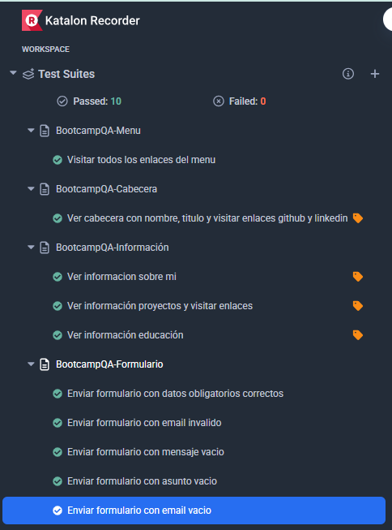

# Portfolio QA - María Jesús y Laura MD
This is our portfolio QA Projects  
🔗 ([https://marialauramdqa.github.io/portfolioqa/](https://marialauramdqa.github.io/portfolioqa/))

---

## 🛠 Tecnologías utilizadas

---

## ⚙️ Main Features
- Responsive navigation menu
- Header with name, professional title, and social media links.
- QA projects section with detailed descriptions
- Education background section
- Contact form

---

## QA Tests
This portfolio includes automated regression testing using **Katalon Studio (Selenium)** for all main features. 

To Run the test:
1. Download the test foder.
2. Open **Google Chrome**, search for and install the extension **Katalon Recorder (Selenium Test)** from the [🔗 Extensiones Chrome](https://chromewebstore.google.com/ )
3. Open the **Katalon Recorder** extension and select **Open test suite**. Locate and open the downloaded **test** folder.
4. Run the test by clicking **Play all suites**.

---

## 👩‍💻 Authors
**María Jesús Monge** 
**Laura Monge Domínguez**

